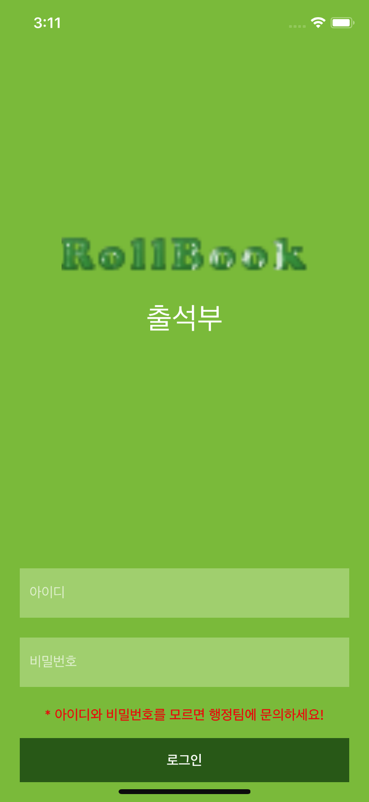
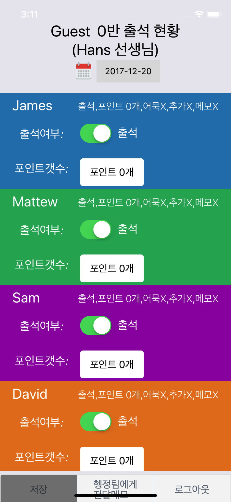
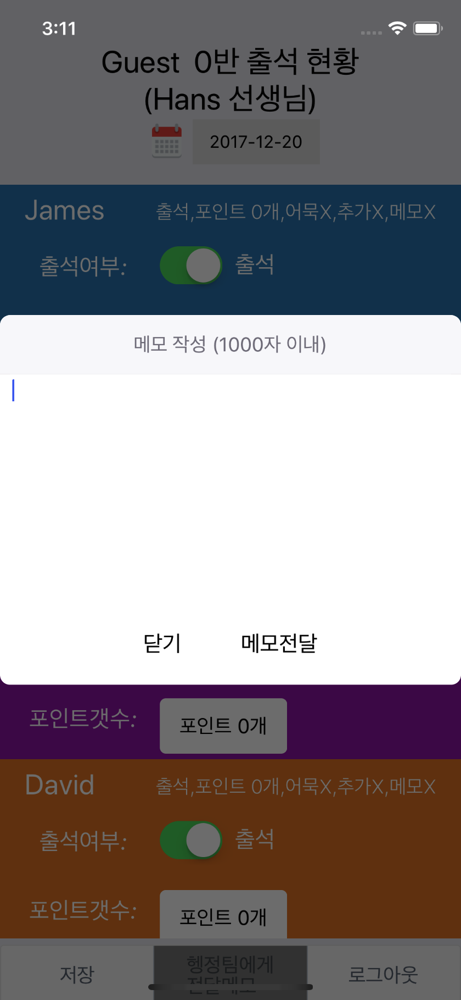
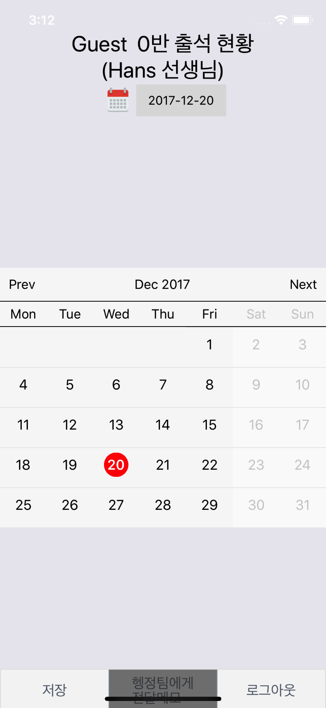

# RollBookApp
This App was made with React Native 
This is my personal project for implementing iOS / Android application with React Native 

  
  
  
  
  

## Prerequisites
- Make Comppnent/Const.js and write the belowcode
  <pre><code>
  export const ServiceURL = 'http://logcalhost';
  export const BrandTitle = '출석부';  
  </code></pre>

## References
